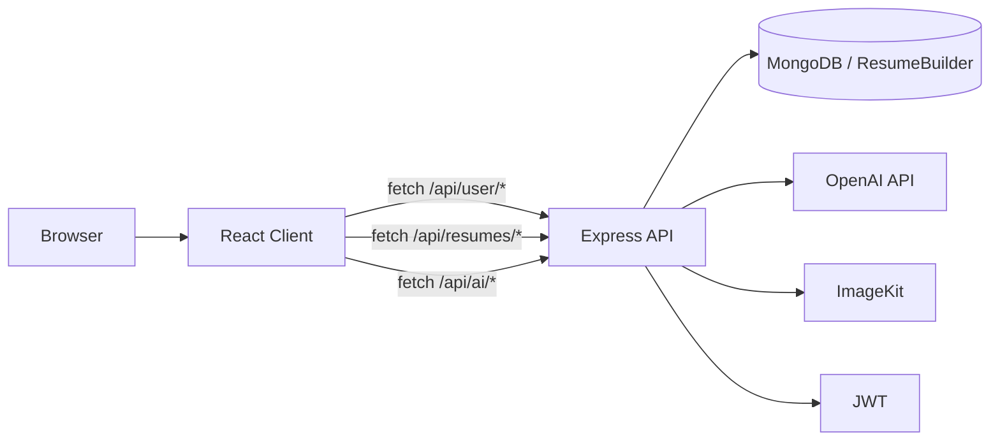

# Resume Builder

AI Resume Builder is a full-stack resume and portfolio application with a React/Vite client, an Express/Mongoose API, JWT-based authentication, and AI-assisted resume tooling. The project lets authenticated users create resumes, edit structured sections, generate AI-written resume content, publish public previews, and create portfolio pages from stored resume data.

## Project Overview

The application is split into two main parts:

- `client/`: a React single-page app built with Vite, React Router, Tailwind CSS v4, and Lucide icons.
- `server/`: an Express API that handles authentication, resume persistence, AI generation, and public/private resume access.

The backend stores users and resumes in MongoDB through Mongoose. AI features use the OpenAI SDK, while resume images can be uploaded through ImageKit when configured, with a base64 fallback when ImageKit credentials are missing.

## Key Features

- User registration and login with JWT authentication.
- Protected dashboard for managing resumes.
- Blank resume creation.
- AI resume creation from pasted raw resume text.
- AI-generated resume creation from a profession prompt.
- Resume editing for personal information, summary, skills, work experience, projects, education, certifications, languages, and interests.
- Resume image upload with ImageKit upload support and local base64 fallback.
- Public and private resume preview routes.
- Printable resume templates with four render styles.
- Portfolio page rendering from stored resume data.
- AI tools for summary enhancement, job description enhancement, skill suggestions, ATS analysis, job matching, cover letters, interview prep, LinkedIn optimization, resume roasting, achievement bullet rewriting, and career insights.
- AI headshot prompt generator for Gemini.

## Tech Stack

| Layer | Technologies |
|---|---|
| Frontend | React 19, React Router DOM 7, Vite 8, Tailwind CSS 4, Lucide React |
| Backend | Node.js, Express 5, Mongoose 9, JSON Web Token, bcrypt, CORS, dotenv |
| AI | OpenAI SDK, `genai` package installed in the server package, OpenAI-compatible chat completions |
| Media | Multer, ImageKit Node SDK |
| Tooling | ESLint, Nodemon, Concurrently |

## Architecture Overview



The client stores the authenticated user and token in `localStorage` and sends requests through an API helper that adds the `Authorization: Bearer <token>` header when available. The server reads environment variables directly from `process.env`, connects to MongoDB at startup, and exposes versionless REST endpoints under `/api`.

## Folder Structure

| Path | Purpose |
|---|---|
| `package.json` | Root scripts for installing and running client/server together |
| `client/` | Frontend application |
| `client/src/App.jsx` | Route definitions and protected route wiring |
| `client/src/context/AuthContext.jsx` | Auth state, API helper, and toast notifications |
| `client/src/pages/` | Pages for home, login, dashboard, builder, preview, portfolio, and headshot generation |
| `client/src/components/` | Shared UI components and home-page sections |
| `client/src/assets/templates/` | Standalone template variants present in the repo; the active renderer is in `client/src/components/ResumeTemplates.jsx` |
| `client/src/assets/assets.js` | Static dummy resume data used as local sample content |
| `client/public/` | Static assets such as logo, favicon, and icons |
| `server/` | Backend application |
| `server/server.js` | Express app bootstrap and route registration |
| `server/configs/` | Database, AI, ImageKit, and Multer configuration |
| `server/controllers/` | Route handlers for auth, resumes, and AI features |
| `server/middlewares/` | JWT auth middleware |
| `server/models/` | Mongoose models for users and resumes |
| `server/routes/` | API route definitions |

## Installation Steps

1. Install dependencies for the root package and both apps:

```bash
npm run install-all
```

2. Create a server environment file at `server/.env` with the variables listed below.
3. Create a client environment file at `client/.env` if you want to override the API base URL.
4. Start the development environment:

```bash
npm run dev
```

## Prerequisites

- Node.js installed locally.
- A MongoDB instance or MongoDB Atlas connection string.
- An OpenAI-compatible API key and model name for AI endpoints.
- Optional ImageKit credentials if you want image uploads to be stored in ImageKit.

## Environment Variables

### Server `.env`

The server reads the following variables from `process.env`:

| Variable | Required | Purpose |
|---|---|---|
| `PORT` | No | Server port. Defaults to `3000`. |
| `MONGODB_URL` | Yes | MongoDB connection string base. The app appends `/ResumeBuilder` automatically. |
| `JWT_SECRET` | Recommended | JWT signing and verification secret. |
| `JWT_SECRET_` | Supported fallback | Alternate JWT secret name used in code when `JWT_SECRET` is absent. |
| `OPEN_API_KEY` | Optional fallback | OpenAI API key accepted by the AI client. |
| `OPENAI_API_KEY` | Yes for AI features | OpenAI API key used by the AI client. |
| `OPENAI_BASE_URL` | No | Optional OpenAI-compatible base URL. |
| `OPENAI_MODEL` | Yes for AI features | Model name used for every AI request. |
| `IMAGEKIT_PUBLIC_KEY` | Optional | ImageKit public key. |
| `IMAGEKIT_PRIVATE_KEY` | Optional | ImageKit private key. |
| `IMAGEKIT_URL_ENDPOINT` | Optional | ImageKit URL endpoint. |
| `NODE_ENV` | No | Used to avoid starting a listener in production/Vercel. |
| `VERCEL` | No | Checked together with `NODE_ENV` when deciding whether to call `app.listen`. |

### Client `.env`

| Variable | Required | Purpose |
|---|---|---|
| `VITE_API_URL` | No | Overrides the backend base URL. Defaults to `http://localhost:3000`. |

## Configuration Guide

- The server boots from `server/server.js`, connects to MongoDB immediately, enables JSON parsing and CORS, and mounts routes under `/api/user`, `/api/resumes`, and `/api/ai`.
- MongoDB is configured in `server/configs/db.js`. The database name is hardcoded as `ResumeBuilder`.
- The AI client is configured in `server/configs/ai.js` with `OPEN_API_KEY` or `OPENAI_API_KEY`, plus optional `OPENAI_BASE_URL`.
- Image uploads use `server/configs/imagekit.js`. If ImageKit credentials are missing or still placeholder values, resume image uploads fall back to base64 data URLs.
- File uploads use `server/configs/multer.js` with disk storage and no custom destination config.
- The frontend API helper in `client/src/context/AuthContext.jsx` attaches JSON headers automatically and adds the JWT bearer token when present.

## Database Setup

The application uses MongoDB via Mongoose. The connection code calls:

```js
await mongoose.connect(`${MONGODB_URL}/ResumeBuilder`);
```

That means `MONGODB_URL` should point to the server and base path, not already include the `ResumeBuilder` database name if you want to follow the existing convention.

### Data Collections

- `users` via the `User` model.
- `resumes` via the `Resume` model.

### Schema Summary

#### User

| Field | Type | Notes |
|---|---|---|
| `name` | String | Required |
| `email` | String | Required, unique |
| `password` | String | Required, stored hashed |
| `createdAt` / `updatedAt` | Date | Added by Mongoose timestamps |

#### Resume

| Field | Type | Notes |
|---|---|---|
| `userId` | ObjectId | References `User` |
| `title` | String | Defaults to `Untitled Resume` |
| `public` | Boolean | Defaults to `false` |
| `template` | String | Defaults to `Classic` |
| `accent_color` | String | Defaults to `#3b82f6` |
| `professional_summary` | String | Defaults to empty string |
| `skills` | String[] | Defaults to empty array |
| `personal_info` | Object | Includes image, full name, email, profession, phone, location, and LinkedIn |
| `experience` | Object[] | Company, position, dates, description |
| `projects` | Object[] | Name, description, link |
| `education` | Object[] | Institution, degree, field_of_study, graduation_date, gpa |
| `certifications` | Object[] | Name, issuer, date |
| `languages` | Object[] | Name, proficiency |
| `interests` | String[] | Defaults to empty array |
| `portfolio_layout` | String | Defaults to `Sleek Dark` |
| `portfolio_enabled` | Boolean | Defaults to `true` |
| `createdAt` / `updatedAt` | Date | Added by Mongoose timestamps |

## Running the Project

### Root scripts

| Script | Command | Purpose |
|---|---|---|
| `install-all` | `npm install && npm install --prefix client && npm install --prefix server` | Installs dependencies for root, client, and server |
| `dev` | `concurrently "npm run dev --prefix client" "npm run server --prefix server"` | Runs client and server together in development |
| `start-client` | `npm run dev --prefix client` | Starts the Vite dev server |
| `start-server` | `npm run server --prefix server` | Starts the backend in nodemon mode |

### Client scripts

| Script | Command | Purpose |
|---|---|---|
| `dev` | `vite` | Starts the frontend dev server |
| `client` | `vite` | Alias for `dev` |
| `build` | `vite build` | Produces a production build |
| `lint` | `eslint .` | Lints the client code |
| `preview` | `vite preview` | Serves the built client locally |

### Server scripts

| Script | Command | Purpose |
|---|---|---|
| `start` | `node server.js` | Starts the API server |
| `server` | `nodemon server.js` | Starts the API server with auto-reload |

## Build Process

- Frontend production builds are created with `npm run build` inside `client/`, which runs `vite build`.
- The backend has no separate build step; it is run directly with Node.js.
- The server entry point avoids listening in production/Vercel-style runtimes and instead exports the Express app for serverless deployment.

## Deployment Instructions

### Client on Vercel

The client includes `client/vercel.json` with a rewrite rule that sends all paths to `index.html`, which is required for React Router SPA routes.

### Server on Vercel

The server includes `server/vercel.json` configured with `@vercel/node` and a catch-all route that sends all requests to `server.js`.

### General Notes

- Set the production API URL with `VITE_API_URL` in the client environment.
- Set all required server environment variables in the hosting platform.
- Make sure the MongoDB connection string and OpenAI credentials are available in the deployed environment.

## API Documentation

All endpoints below are taken directly from the Express routes and controllers.

### Health Check

| Method | Endpoint | Auth | Description |
|---|---|---|---|
| GET | `/` | No | Returns `Server is live..` |

### User Routes

| Method | Endpoint | Auth | Description |
|---|---|---|---|
| POST | `/api/user/register` | No | Creates a user, hashes the password, and returns a JWT plus user object |
| POST | `/api/user/login` | No | Authenticates a user and returns a JWT plus user object |
| GET | `/api/user/profile` | Yes | Returns the current user profile without the password |
| GET | `/api/user/resumes` | Yes | Returns all resumes owned by the authenticated user |

#### Register Request

```json
{
  "name": "Jane Doe",
  "email": "jane@example.com",
  "password": "secret123"
}
```

#### Login Request

```json
{
  "email": "jane@example.com",
  "password": "secret123"
}
```

### Resume Routes

| Method | Endpoint | Auth | Description |
|---|---|---|---|
| POST | `/api/resumes/create` | Yes | Creates a blank resume with an optional title |
| PUT | `/api/resumes/update/:resumeId` | Yes | Updates a resume and optionally uploads an image file under `image` |
| PUT | `/api/resumes/update` | Yes | Same update logic, but reads `resumeId` from the body or nested data |
| DELETE | `/api/resumes/delete/:resumeId` | Yes | Deletes the authenticated user’s resume |
| GET | `/api/resumes/get/:resumeId` | Yes | Fetches a resume owned by the authenticated user |
| GET | `/api/resumes/public/:resumeId` | No | Fetches a public resume only if `public: true` |

#### Update Request Shape

The update endpoint accepts multipart form data when uploading an image.

| Field | Type | Notes |
|---|---|---|
| `resumeData` | Stringified JSON or object | Main resume payload |
| `image` | File | Optional image upload |

### AI Routes

All AI routes require authentication through the `protect` middleware.

| Method | Endpoint | Description | Response Shape |
|---|---|---|---|
| POST | `/api/ai/enhance-pro-sum` | Enhances a professional summary | `{ enhancedContent }` |
| POST | `/api/ai/enhance-job-description` | Enhances a job description bullet or paragraph | `{ enhancedContent }` |
| POST | `/api/ai/upload-resume` | Parses raw resume text into structured data and saves it | `{ resumeId }` |
| POST | `/api/ai/suggest-skills` | Suggests skills for a profession | `{ skills: [] }` |
| POST | `/api/ai/generate-resume-prompt` | Generates a complete resume from profession details and saves it | `{ resumeId }` |
| POST | `/api/ai/analyze-ats` | Returns ATS analysis data | JSON object with score, missing keywords, missing sections, and suggestions |
| POST | `/api/ai/job-match` | Compares a resume to a job description | JSON object with match percentage, matching skills, missing skills, and recommendations |
| POST | `/api/ai/cover-letter` | Generates a cover letter | `{ coverLetter }` |
| POST | `/api/ai/interview-coach` | Generates interview prep questions and sample answers | JSON object with `questions` |
| POST | `/api/ai/linkedin` | Generates LinkedIn profile assets | JSON object with `headlines`, `about`, and `suggestions` |
| POST | `/api/ai/roast` | Returns a playful resume critique | JSON object with `roast`, `weakpoints`, and `encouragement` |
| POST | `/api/ai/enhance-achievements` | Turns a phrase into stronger achievement bullets | JSON object with `bullets` |
| POST | `/api/ai/career-insights` | Produces career strength and market-readiness metrics | JSON object with `resumeStrength`, `interviewReadiness`, `marketReadiness`, `skillGapAnalysis`, and `marketOutlook` |

#### Common AI Request Fields

| Field | Used By | Notes |
|---|---|---|
| `userContent` | Summary and job description enhancers | Free-form text to rewrite |
| `resumeText` | Resume upload parser | Raw resume text to extract into JSON |
| `profession` | Skill suggestion and generated resume flow | Job title or target profession |
| `experienceLevel` | Generated resume flow | Required for resume generation from prompt |
| `briefBackground` | Generated resume flow | Optional context about the user |
| `resumeData` | Analysis, cover letter, interview, LinkedIn, roast, career insights, job match | Structured resume object |
| `jobDescription` | Job match and cover letter | Optional in cover letter, required in job match |
| `tone` | Cover letter | Optional writing tone |
| `text` | Achievement enhancement | Draft phrase to rewrite |

## Authentication & Authorization Flow

- `POST /api/user/register` hashes the password with bcrypt, creates the user, and signs a JWT valid for 7 days.
- `POST /api/user/login` verifies credentials and returns a JWT plus user summary.
- The JWT payload contains `userId`.
- The `protect` middleware reads the token from `Authorization`, accepts either a raw token or a `Bearer ` prefix, verifies it with `JWT_SECRET_` or `JWT_SECRET`, and attaches `req.userId`.
- Resume ownership checks use `userId` in the query for read, update, and delete operations.
- Public previews are available only when `resume.public === true`.

## Third-party Integrations

| Service | Usage |
|---|---|
| OpenAI | Generates resume content, analysis, cover letters, and other AI outputs |
| MongoDB | Stores users and resumes |
| ImageKit | Stores uploaded profile images when configured |
| Vercel | Supported deployment target for both client and server through included config files |

The headshot generator page does not call an external image-generation API. It only generates a prompt that the user can copy into Google Gemini manually.

## Background Jobs / Cron Tasks

No background jobs, cron jobs, or scheduled tasks are implemented in the repository.

## Testing Instructions

No test files or automated test scripts are present in the repository.

Available validation tooling from the existing scripts:

- `npm run lint` in `client/`.
- `npm run build` in `client/`.
- Running the server locally with `npm run server` in `server/`.

## Troubleshooting

- If authentication fails immediately after login, confirm that the JWT secret in the environment matches the one used by the server process.
- If AI endpoints return errors, confirm `OPENAI_MODEL` and either `OPEN_API_KEY` or `OPENAI_API_KEY` are set.
- If resume image uploads fall back to data URLs, ImageKit credentials are missing or still using placeholder values.
- If public preview URLs return `Access Restricted`, verify that the resume is marked public in the builder or dashboard.
- If routes fail after deployment, confirm the client rewrite config is active so React Router paths resolve to `index.html`.
- If the server does not start in production hosting, confirm the platform is using the exported app rather than calling `app.listen` in a Vercel-style runtime.

## Security Notes

- Passwords are hashed with bcrypt before storage.
- JWT verification is enforced on protected routes.
- Resume ownership is checked against the authenticated user ID.
- Public resume views are intentionally limited to records with `public: true`.
- The code includes a fallback `fallback_secret` for JWT signing when secrets are missing, which is not suitable for production and should be replaced with an explicit secret.
- The server accepts ImageKit fallback behavior and base64 image storage when credentials are absent; that keeps the app functional but is not ideal for large production uploads.

## Development Workflow

1. Start MongoDB and set the required server environment variables.
2. Run `npm run dev` from the repository root.
3. Use the login page to register or sign in.
4. Create a resume from the dashboard.
5. Edit the resume in the builder.
6. Save or print the resume.
7. Toggle public visibility when you want a shareable link.

The dashboard also exposes the AI headshot prompt helper, career insights dashboard, and portfolio configuration panel.

## Contribution Guidelines

No repository-specific contribution policy is defined in the source tree.

If you plan to contribute, follow the existing code style:

- Use functional React components and hooks.
- Keep route and controller naming consistent with the current API patterns.
- Preserve the resume schema fields used by the builder and templates.
- Avoid introducing unsupported claims into documentation or UI copy.

## License Information

The repository contains `ISC` in `server/package.json`, but the root package and client package do not define a dedicated license file.

## TODO / Information Not Found in Code

- No automated test suite or test commands were found.
- No `.env.example` file is present.
- No repository-level contribution guide was found.
- No formal API versioning strategy is implemented.
- No background job or scheduled task system is implemented.
- No formal license file is present at the repository root.

## Files Analyzed

- `package.json`
- `client/package.json`
- `server/package.json`
- `server/server.js`
- `server/configs/db.js`
- `server/configs/ai.js`
- `server/configs/imagekit.js`
- `server/configs/multer.js`
- `server/controllers/aicontroller.js`
- `server/controllers/resumecontroller.js`
- `server/controllers/Usercontroller.js`
- `server/middlewares/authmiddleware.js`
- `server/models/resume.js`
- `server/models/user.js`
- `server/routes/airoutes.js`
- `server/routes/resumeroutes.js`
- `server/routes/userRoutes.js`
- `server/vercel.json`
- `client/vite.config.js`
- `client/vercel.json`
- `client/index.html`
- `client/eslint.config.js`
- `client/src/App.jsx`
- `client/src/main.jsx`
- `client/src/context/AuthContext.jsx`
- `client/src/pages/Home.jsx`
- `client/src/pages/Layout.jsx`
- `client/src/pages/Login.jsx`
- `client/src/pages/Dashboard.jsx`
- `client/src/pages/ResumeBuilder.jsx`
- `client/src/pages/Preview.jsx`
- `client/src/pages/PortfolioView.jsx`
- `client/src/pages/HeadshotGenerator.jsx`
- `client/src/components/ProtectedRoute.jsx`
- `client/src/components/Navbar.jsx`
- `client/src/components/ResumeTemplates.jsx`
- `client/src/components/Home/Banner.jsx`
- `client/src/components/Home/Hero.jsx`
- `client/src/components/Home/Features.jsx`
- `client/src/components/Home/Testimonial.jsx`
- `client/src/components/Home/CallToAction.jsx`
- `client/src/components/Home/Footer.jsx`
- `client/src/components/Home/Title.jsx`
- `client/src/index.css`
- `client/src/assets/assets.js`
- `client/src/assets/templates/ClassicTemplate.jsx`
- `client/src/assets/templates/ModernTemplate.jsx`
- `client/src/assets/templates/MinimalTemplate.jsx`
- `client/src/assets/templates/MinimalImageTemplate.jsx`
- `.gitignore`

## Features Discovered

- JWT registration and login.
- Protected dashboard and builder routes.
- Blank resume creation.
- AI resume parsing from pasted text.
- AI resume generation from a profession prompt.
- Manual resume editing with multiple structured sections.
- Resume image upload with ImageKit fallback.
- Public and authenticated preview routes.
- Printable resume templates.
- Portfolio page generation and style selection.
- AI summary, job description, skills, ATS, job match, cover letter, interview prep, LinkedIn, roast, bullet enhancement, and career insights tooling.
- Gemini headshot prompt generator with local prompt saving.

## Missing Documentation Areas

- No test coverage or test commands.
- No environment sample file.
- No explicit deployment walkthrough beyond the Vercel configs.
- No issue tracker or contribution policy in-repo.
- No formal license file.

## Recommended README Improvements

- Add a real `.env.example` file for both client and server.
- Add automated tests and document them in the root README.
- Add a formal license file if one is intended.
- Add deployment-specific notes for the actual hosting provider if it differs from Vercel.
- Add API example payloads and sample responses for the AI routes if the contract becomes stable.